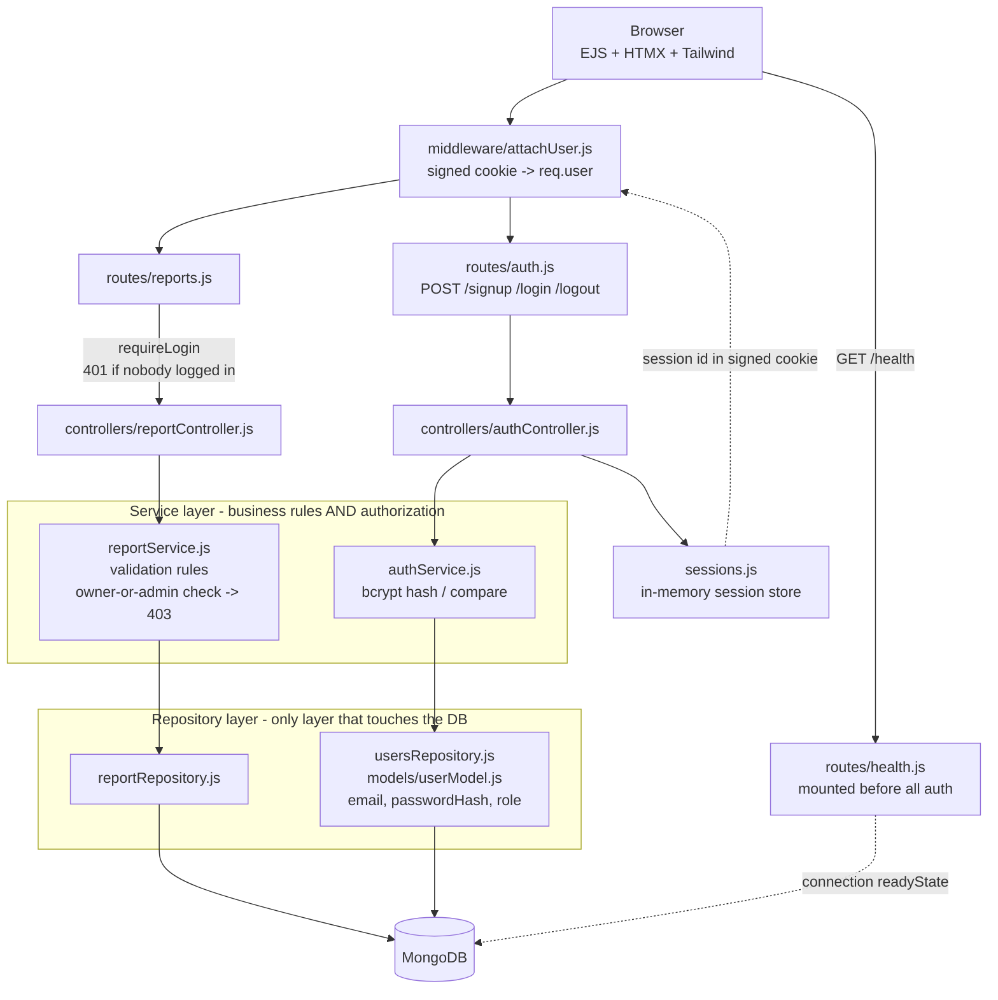

# Section 1

| Name           | GitHub Username |
| -------------- | --------------- |
| Christian Diaz | christiangdiaz  |
| Yougi Jain     | yougijain       |

# Section 2

- Communication as needed, daily / every other day via text.
- Done for a PR means passing review from other teammate.
- Will resolve disagreements by communicating openly and finding solutions that both are happy with.

# Section 3

Our team is building an apartment maintenance report board where residents submit maintenance problems with a simple description, and apartment maintenance answers and resolves issues. This addresses issues in poorly managed complaint systems for apartments that still track reports phone call by phone call. Residents also benefit by seeing the status and estimated fix time for their complaints instead of needing to call for updates over and over. Beyond the classroom, this reduces the gap that maintenance often needs to have in following up with residents, having to handle it themselves, and tracking and organizing complaints for them. Primary action would be submitting and resolving a complaint report by residents and maintenance staff, respectively, with staff-side status updates to be added in later sprints.

# Section 4: How to Get Started

1. Clone the repository `git clone https://github.com/christiangdiaz/326-project.git`

2. Install dependencies `npm install`

3. Start MongoDB. Any one of these works:
   - Docker: `docker run -d --name mongo -p 27017:27017 mongo:7`
   - A local `mongod` on the default port
   - Your own server: set `MONGODB_URI` before starting

   The app defaults to `mongodb://127.0.0.1:27017/maintenance_reports`. **No `.env` file and no secrets are required** — if you have MongoDB running on the default port, it just works.

4. Seed the database with sample reports:

   ```
   npm run seed
   ```

5. Start the server with `npm start`

   Creating an **admin** account: Start with `ADMIN_EMAIL` set instead.

   For the `admin` role:

   ```
   ADMIN_EMAIL=admin@example.com npm start
   ```

6. Finally, visit `http://localhost:3000` (or `http://localhost:3000/reports`) to see the Maintenance Report Board.

To run the test suite: `npm test`

# Section 5: Feature 1 - Report Submission

Primary action is a resident submitting a maintenance report.

- Visit `http://localhost:3000/reports`
- Two fields include **Unit number** and **Problem description**
- **Submit report** button. This POSTs to `/reports`.
- Submission is validated in the service layer. A valid report is saved to the **MongoDB `reports` collection** with a MongoDB-generated `_id` and a default `status` of `Open`, then the new report appears in the **Submitted Reports** list.
- **Validation:** If a field is missing, the page re-renders with an inline error ("Unit number and description are required.") and an HTTP `400` status — nothing is saved.

# Sprint 3 Changes

## 1. MongoDB (Mongoose) repository, replacing the JSON file

`repositories/reportRepository.js` no longer touches the filesystem. It now defines a Mongoose schema and exposes **per-record** operations instead of the old whole-array `readReports` / `saveReports` pair.

**Schema** (`unit`, `description`, `status`, plus `timestamps`):

| Field         | Type   | Rules                                                                 |
| ------------- | ------ | --------------------------------------------------------------------- |
| `unit`        | String | required, trimmed, max 10                                             |
| `description` | String | required, trimmed, max 500                                            |
| `status`      | String | enum `Open` / `In Progress` / `Resolved`, defaults to `Open`, indexed |

**Operations:** `getAll`, `findById`, `create`, `updateById`, `removeById`.

The connection lives in `config/db.js`, which reads `process.env.MONGODB_URI` and falls back to `mongodb://127.0.0.1:27017/maintenance_reports`. `reports.json` has been deleted from the repository.

**How to see it:** start MongoDB and run `npm start`, then submit a report at `http://localhost:3000/reports`. Both `GET /reports` and `POST /reports` now hit MongoDB. **Restart the server and the report is still there** — that is the proof it is no longer a JSON file. You can also inspect the collection directly:

```
docker exec -it mongo mongosh maintenance_reports --eval "db.reports.find()"
```

## 2. Jest tests for every service-layer business rule

`__tests__/reportService.test.js` covers all 18 cases with the repository replaced by `jest.unstable_mockModule`. **No database connection is opened** — the suite runs in roughly a quarter of a second.

Rules under test:

- `addReport` — unit required, description required, both rejected when whitespace-only, called with no argument at all
- `addReport` — unit at most 10 characters, description at most 500
- `addReport` — trims both fields, uppercases the unit, and forces `status: "Open"` even if the client supplies one
- `updateReportStatus` — id required, status must be one of the three allowed values, report must exist
- `deleteReport` — id required, report must exist
- Plus the happy path of each, asserting the repository is called with the right arguments and is **not** called at all when validation fails

**How to see it:** run `npm test`. To prove the suite is genuinely mocked rather than quietly talking to a real database, **stop MongoDB first** (`docker stop mongo`) and run it again — it stays green.

`updateReportStatus` and `deleteReport` back the repository's `updateById` and `removeById`, and are the service-layer seam the HTMX interaction calls.

## 3. HTMX interaction

Deleting a maintenance report now uses HTMX instead of reloading the entire page.

Each report has a Delete button with `hx-delete`, which sends a `DELETE /reports/:id` request. The server deletes the report and returns an empty response. HTMX then replaces only that report's `<article>` element, so the rest of the page stays unchanged.

**How to see it:** run the app, visit `http://localhost:3000/reports`, submit a report, then click **Delete**. The report disappears without a full page reload.

## 4. Tailwind visual design

The reports page is now styled using Tailwind utility classes directly in `views/reports.ejs`.

The form and report list use cards, spacing, typography, button states, and a responsive layout. Reports display in one column on smaller screens and switch to two columns at the `sm:` breakpoint.

**How to see it:** visit `http://localhost:3000/reports` and resize the browser window from desktop width to phone width.

# Honest Exceptions

The sprint brief asks us to name any layer above the repository that had to change. Two did, and here is exactly why.

**1. Async propagation reached above the repository.** Mongoose is asynchronous and Sprint 2's repository was synchronous, so `services/reportService.js` and `controllers/reportController.js` both became `async`/`await`. That is a real change above the repository line.

What did _not_ change is the layering boundary: no layer above the repository knows a database exists, every function kept its name and arguments, and the controller still talks only to the service. What changed is the calling convention — functions return a Promise instead of a value. Had Sprint 2's repository been Promise-based from the start, nothing above it would have needed to change.

**2. The client-facing id.** Sprint 2's template emitted no record identifier at all: the `forEach` took no index and `report.id` was never rendered, so there was no array-position assumption to unwind. The exception shows up where per-record actions need a stable handle — each `<article>` in `views/reports.ejs` now carries `id="report-<%= report._id %>"`, MongoDB's real `_id`. The service's old `id: Date.now()` generation is gone; MongoDB assigns `_id` instead.

# Sprint 4 Changes

## 1. Authentication

Session cookie was selected over token because this application uses server rendering of the EJS pages through the ordinary form posts, and there is nothing that should be encoded in a bearer token, and server storage allows logging out, while JWTs are valid until their expiration regardless of the server actions.

Passwords are encrypted using bcrypt (cost 10) in the services/authService.js file, and passwordHash is saved. Session cookies are stored in the Map object in sessions.js file, therefore starting the server anew logs out all users. Role in models/userModel.js is an enum of member and admin, and is never set through the signup form — you will have admin role only if your email is equal to ADMIN_EMAIL environment variable.

Sign up and log in steps:

- Run ADMIN_EMAIL=[admin@example.com](mailto:admin@example.com) npm start.
- Go to http://localhost:3000/login.
- Sign up two times: once with [admin@example.com](mailto:admin@example.com) login (admin role) and once with [member1@example.com](mailto:member1@example.com) login (member).
- From the same page log in to the application.
- Header shows the currently used account and role and also has Log out button.

## 2. Authorization

middleware/requireLogin.js ensures that nobody is logged in, and if not, it gives 401 error status. And then, deleteReport in services/reportService.js checks whether this specific user is authorized to edit this particular record, providing 403 error code if not allowed. Service authorization is performed after retrieving the record using findById method because the ownership check is possible only when the record is retrieved.

What needs testing is deleting the report. You need to create a report as member1, then try curl -i -X DELETE http://localhost:3000/reports/<id> for: nobody, who is not logged in (401 status error), member2 (403 status error, the report is not deleted, but the service authorizes user, 403 status error), member1 (200 status error, deleted), admin (200 status error, role overrides ownership). It will work even in the browser, using different accounts.

## 3. Accessibility fixes

Delete is within the article that hx-swap="outerHTML" deletes, so delete report causes deletion of the focused element and focus returns to the body. Now public/app.js focuses the Delete button of the next report or of the "Submitted Reports" header if there are no reports left. HTMX swaps on 2xx only, so a delete blocked by a 403 did nothing. Now role="status" announces both results.

No way to navigate to the login page: neither view contained /login, and there was no sign-out control anywhere. views/partials/header.ejs adds a skip link, a sign-in status indicator, a Sign out button, and a login link. The main element has tabindex="-1", so that the skip link would move the focus instead of scrolling to the top. On /reports there are nine controls in the right tab order. Six text fields have a meaningful label with for, and each Delete button has aria-label="Delete report for unit 2C". views/auth.ejs was refactored as well, having no lang, no viewport meta, and two h1 elements. A failed login previously redirected to an ordinary text page, without any way to return to the application; errors now render inline in a role="alert".

Contrast was calculated for rendered pixels with getComputedStyle, taking into account hover, against the WCAG algorithm. Two surfaces are non-compliant: the input placeholder at 2.54 (now 7.56) and the input border at 1.47 against the 3.0 minimum for non-text contrast (now 4.83). It is the hidden one — we never explicitly defined its color, and it inherited gray-400 from Tailwind preflight, which is not present in our markup and could not be detected through class reading. Buttons already were compliant, at 4.83 to 6.70 including hover, but were darkened slightly for hover margin and now have 6.47 to 8.72 contrast.

Verification steps: Tab from the top of /reports — the skip link should be the first thing to receive focus, and focus should never jump to the top of the page after a delete. Sign in as two accounts, and delete each other's reports using the keyboard. Put a color picker on the Submit and Delete buttons, with hover.

## 4. Health check

routes/health.js serves GET /health
mounted in server.js above cookieParser and attachUser so no auth middleware runs in front of it

```
curl http://localhost:3000/health

{ "status": "ok", "database": "connected", "uptime": 834 }
```

Returns 200 while MongoDB is connected and 503 with "status": "degraded" if the database drops.
No cookie required.

# System Diagram


